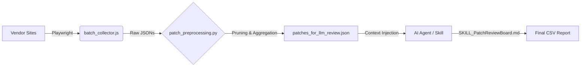

# Automation Research: Deep Dive Guide

This document provides a comprehensive analysis of the **OS Patch Review Board Automation** research project. This project aims to replace manual OS patch reviews with a fully automated, AI-driven pipeline that collects, filters, analyzes, and reports on critical OS security advisories.

## 1. Architecture Overview

The automation pipeline consists of three distinct stages:

1.  **Data Collection (Harvesting)**: Headless browser execution to scrape vendor security advisories.
2.  **Preprocessing (refining)**: Python-based filtering, deduping, and critical system component identification.
3.  **AI Analysis (Decision Making)**: LLM-based deep semantic analysis to determine business impact and risk.

---

## 2. Component Analysis

### A. Data Collector (`batch_collector.js`)
*   **Technology**: Node.js + Playwright (Headless Chromium)
*   **Target Vendors**:
    *   **Red Hat**: Scrapes `access.redhat.com/errata-search`. Handles pagination and extracts dates, severity, and full advisory text.
    *   **Oracle Linux**: Parses `oss.oracle.com/pipermail/el-errata` mailing list archives. Identifies UEK (Unbreakable Enterprise Kernel) updates specifically.
    *   **Ubuntu**: Scrapes `ubuntu.com/security/notices` (USN). Filters by LTS versions (22.04, 24.04, etc.) and specific collection periods.
*   **Features**:
    *   **Concurrency**: Processes multiple advisory pages in parallel (`MAX_CONCURRENCY`).
    *   **Content Extraction**: Removes DOM clutter (navbars, scripts) to capture clean `full_text` for LLM consumption.
    *   **Output**: Saves individual JSON files in `./batch_data/`.

### B. Preprocessor (`patch_preprocessing.py`)
*   **Role**: The "Gatekeeper". It turns raw, noisy data into a structured review packet.
*   **Key Logic**:
    *   **System Critical Whitelist**: Filters out non-critical software (desktop apps like Firefox, LibreOffice). Only keeps core infrastructure components (Kernel, glibc, systemd, openssl, container runtimes, etc.).
    *   **Vendor-Specific Parsing**:
        *   **Red Hat**: Extracts `Affected Products` to determine the exact RHEL major version (e.g., separating RHEL 9 patches from OpenShift).
        *   **Oracle**: Regex extraction for UEK versions and underlying OL versions.
        *   **Ubuntu**: Identifies and separates updates for different LTS releases (22.04 vs 24.04).
    *   **Aggregation**: Groups multiple advisories for the same component (e.g., 3 kernel updates in a month) into a single review item, providing "History" context to the AI.

### C. AI Skill (`SKILL_PatchReviewBoard.md`)
*   **Role**: The "Analyst". Definitive guide for the AI agent.
*   **Review Logic**:
    *   **Inclusion Criteria**: Must be a System Hang, Data Loss, Boot Failure, or Critical Security (RCE/Privilege Escalation) issue.
    *   **Exclusion Logic**: Ignores Moderate severity, strictly local DoS, or non-default configurations (like "KVM only" if not used).
    *   **Reporting**: Generates a bilingual (Korean/English) description emphasizing the *mechanism* of failure (e.g., "Use-After-Free in standard TCP stack").
    *   **Cumulative Recommendation**: If version -3 supersedes -1, the report points to -3 but notes the critical reasons from -1.

---

## 3. Data Flow & Artifacts

| Stage | Input | Process | Output |
|---|---|---|---|
| **1. Collect** | Vendor Websites | `node batch_collector.js` | `batch_data/*.json` |
| **2. Process** | `batch_data/` | `python patch_preprocessing.py` | `patches_for_llm_review.json` |
| **3. Review** | `patches_for_llm_review.json` | **AI Agent** (`SKILL_PatchReviewBoard.md`) | `patch_review_final_report.csv` |

## 4. Key Improvements (Recent Updates)

*   **RHEL Version Extraction**: Now parses the "Affected Products" text block to correctly identify "RHEL 9" vs "RHEL 8" vs "OpenShift", fixing "Unknown" version issues.
*   **OCP Exclusion**: Explicitly removes OpenShift Container Platform (OCP) advisories that do not touch the base RHEL OS.
*   **Korean Localization**: The final report includes high-quality Korean summaries tailored for Korean TOC (Technical Operations Center) engineers.
