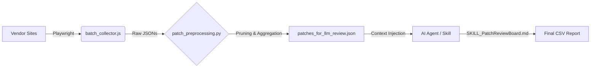

# 자동화 연구: 심층 분석 가이드

본 문서는 **OS 패치 리뷰 보드(PRB) 자동화** 연구 프로젝트에 대한 포괄적인 분석 보고서입니다. 이 프로젝트는 수동으로 수행되던 OS 패치 리뷰 작업을 완전 자동화된 AI 기반 파이프라인으로 대체하여, 중요 OS 보안 권고를 수집, 필터링, 분석 및 보고하는 것을 목표로 합니다.

## 1. 아키텍처 개요

자동화 파이프라인은 세 가지 단계로 구성됩니다:

1.  **데이터 수집 (Harvesting)**: Headless 브라우저를 사용하여 벤더별 보안 권고 사이트를 크롤링합니다.
2.  **전처리 (Refining)**: 파이썬 기반으로 데이터를 필터링하고 중복을 제거하며, 핵심 시스템 구성 요소를 식별합니다.
3.  **AI 분석 (Decision Making)**: LLM 기반의 심층 의미 분석을 통해 비즈니스 영향도와 위험(Risk)을 판단합니다.

---

## 2. 구성 요소 분석

### A. 데이터 수집기 (`batch_collector.js`)
*   **기술 스택**: Node.js + Playwright (Headless Chromium)
*   **대상 벤더**:
    *   **Red Hat**: `access.redhat.com/errata-search`를 스크래핑합니다. 페이지네이션 처리 및 게시일, 심각도, 전체 권고 텍스트를 추출합니다.
    *   **Oracle Linux**: `oss.oracle.com/pipermail/el-errata` 메일링 리스트 아카이브를 파싱합니다. UEK(Unbreakable Enterprise Kernel) 업데이트를 식별합니다.
    *   **Ubuntu**: `ubuntu.com/security/notices` (USN)를 스크래핑합니다. LTS 버전(22.04, 24.04 등)과 특정 수집 기간을 필터링합니다.
*   **주요 기능**:
    *   **동시성**: `MAX_CONCURRENCY` 설정을 통해 여러 권고 페이지를 병렬로 처리합니다.
    *   **콘텐츠 추출**: DOM의 불필요한 요소(네비게이션 바, 스크립트 등)를 제거하고 LLM이 이해하기 쉬운 `full_text`만 추출합니다.
    *   **출력**: 개별 JSON 파일을 `./batch_data/` 디렉토리에 저장합니다.

### B. 전처리기 (`patch_preprocessing.py`)
*   **역할**: "문지기(Gatekeeper)". 수집된 원시(Raw) 데이터의 노이즈를 제거하고 구조화된 리뷰 패킷으로 변환합니다.
*   **핵심 로직**:
    *   **시스템 중요 구성요소 화이트리스트**: 데스크탑 앱(Firefox, LibreOffice 등)을 필터링하고, 핵심 인프라 구성요소(Kernel, glibc, systemd, openssl, container runtimes 등)만 유지합니다.
    *   **벤더별 파싱**:
        *   **Red Hat**: `Affected Products` 섹션을 파싱하여 정확한 RHEL 메이저 버전(예: RHEL 9 vs OpenShift)을 식별합니다.
        *   **Oracle**: 정규식을 사용하여 UEK 버전과 기본 OL 버전을 추출합니다.
        *   **Ubuntu**: LTS 릴리스(22.04 vs 24.04)별 업데이트를 식별하고 분리합니다.
    *   **집계(Aggregation)**: 동일 구성요소에 대한 여러 업데이트(예: 한 달 동안 3번의 커널 업데이트)를 하나의 리뷰 항목으로 그룹화하고, 과거 이력을 "History"로 AI에게 제공합니다.

### C. AI 스킬 (`SKILL_PatchReviewBoard.md`)
*   **역할**: "분석가(Analyst)". AI 에이전트가 따르는 결정적 가이드라인입니다.
*   **리뷰 로직**:
    *   **포함 기준**: 시스템 행(Hang), 데이터 손실, 부팅 실패, 또는 치명적 보안(RCE/권한 상승) 이슈만 포함합니다.
    *   **제외 로직**: Moderate 심각도, 로컬 DoS(서비스 거부), 또는 비표준 설정(예: 사용하지 않는 KVM 전용 이슈)은 무시합니다.
    *   **보고서 작성**: 장애 발생 메커니즘(예: "표준 TCP 스택에서의 Use-After-Free")을 강조한 한글/영문 설명을 생성합니다.
    *   **누적 권장**: 버전 -3이 -1을 대체(supersede)하는 경우, -3을 권장하되 -1의 치명적 사유를 근거로 제시합니다.

---

## 3. 데이터 흐름 및 산출물

| 단계 | 입력 | 처리 프로세스 | 출력 |
|---|---|---|---|
| **1. 수집 (Collect)** | 벤더 웹사이트 | `node batch_collector.js` | `batch_data/*.json` |
| **2. 처리 (Process)** | `batch_data/` | `python patch_preprocessing.py` | `patches_for_llm_review.json` |
| **3. 리뷰 (Review)** | `patches_for_llm_review.json` | **AI Agent** (`SKILL_PatchReviewBoard.md`) | `patch_review_final_report.csv` |

## 4. 주요 개선 사항 (최신 업데이트)

*   **RHEL 버전 추출 고도화**: "Affected Products" 텍스트 블록을 파싱하여 "RHEL 9"와 "RHEL 8", "OpenShift"를 정확히 구분합니다. "Unknown" 버전 문제를 해결했습니다.
*   **OCP 제외 로직**: 기본 RHEL OS에 영향을 주지 않는 OpenShift Container Platform (OCP) 전용 권고를 명시적으로 제외합니다.
*   **한국어 현지화**: 최종 보고서는 한국의 TOC(Technical Operations Center) 엔지니어를 위해 고품질의 한글 요약을 포함합니다.
